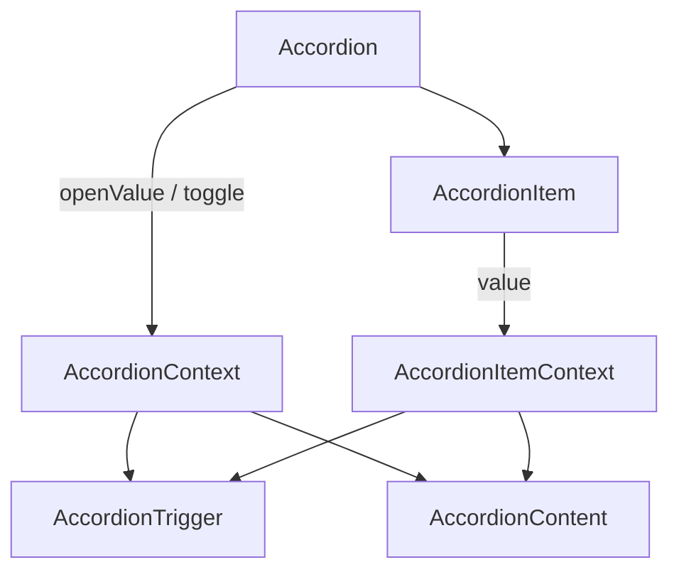

# Accordion Context 구조



## 내가 정리한 것

아코디언 컴포넌트가 있고 그 안에 아코디언 아이템이 존재한다.
아코디언 아이템에 타이틀을 누르면 트리거가 되고 그렇게 되면 콘텐트가 보인다.

## Question

Q1. 열린상태는 누가 가지고 있는가?
A1: ~~AccordionContext~~
Accordion.tsx

Q2. 클릭하면 어떤 함수가 실행되는가?
A2: 모르겠다..

Q3. Trigger가 자기 item 의 value를 어떻게 알았는지?
A3: AccordionItemContext 때문에 AccordianItem으로부터 넘겨받는다 props

Q4. content는 자신이 열려있는지 어떻게 알았지?
A4: AccordianItemContext 때문에 AccordianItem으로부터 넘겨받는다 props

Q5. context가 왜 2개였지?
A5: 모르겠다..

## 코드보고 다시 정리하기

1. Accordion.tsx를 연다.

2. openValue를 검색한 후 어디서 만들어지는지 찾는다.
   -> useState

3. AccordionContext.Provider를 찾아서 value에 무엇을 넣는지 적는다.
   -> AccordionContext.Provider의 value엔 openValue, toggle 함수를 넣는다.

4. AccordionTrigger.tsx를 열어서 onClick을 찾는다. 클릭하면 어떤 함수를 호출하는지 적는다.
   -> toggle(itemValue)

5. 그 함수를 따라간다. 그리고 함수가 어디에서 만들어졌는지 찾는다.
   -> AccordionContext Accordion.tsx에서 toggle 함수

```typescript
const toggle = (itemValue: string) => {
  setOpenValue((prev) => {
    if (prev.includes(itemValue)) {
      return prev.filter((v) => v !== itemValue);
    } else {
      return [...prev, itemValue];
    }
  });
};
```

6. AccordionItem.tsx를 연다. AccordionItemContext.Provider에 무엇을 넣는지 확인한다.
   -> value에 받아온 { itemValue: value } 를 넘긴다

7. AccordionContent.tsx를 연다. "내가 열렸는지" 판단하는 조건을 찾는다.
   -> const isOpen = openValue.includes(itemValue); isOpen이 true인지 확인한다.

## Question 다시 대답하기

### Q1. 열린 상태는 누가 가지고 있는가?

A1:

- `openValue`가 선언된 곳: Accordion.tsx에서 useState로 선언됨.
- 실제 state 소유자: Accordion.tsx
- AccordionContext가 하는 역할: openValue, toggle 을 가지고 있는 연결 통로역할

### Q2. Trigger를 클릭하면 어떤 함수가 실행되는가?

A2:

- onClick: () => toggle(itemValue)
- 호출되는 함수: toggle
- 그 함수가 정의된 곳: Accordion.tsx
- 결국 어떤 state가 변경되는가: openValue

### Q3. Trigger는 자기 Item의 value를 어떻게 아는가?

A3:

- 사용하는 Context: useContext를 사용해서 AccodionItemContext를 불어옴.
- value를 Provider에 넣어주는 컴포넌트: AccordionItem.tsx
- 실제 코드:

```typescript
export const AccordionItem = ({ children, value }: IAccordionProps) => {
  return (
    <AccordionItemContext.Provider value={{ itemValue: value }}>
      {children}
    </AccordionItemContext.Provider>
  );
};
```

### Q4. Content는 자신이 열려있는지 어떻게 판단하는가?

A4:

- 필요한 값: openValue, itemValue
- 각각 어디서 가져오는가: AccordionContext에서 openValue를 AccodionItemContext에서 itemValue를 가져온다.
- 비교 조건: openValue안에 itemValue가 들어있는지 확인한다. openValue.includes(itemValue)

### Q5. Context가 왜 2개인가?

A5:

AccordionContext:

- 가지고 있는 값: openValue, toggle
- 이 값이 필요한 이유: 전체값을 가지고 있어야 하기 때문에 각각 어디 부분이 열려있는지 파악하기 위해서

지선생 답: Accordion 전체에서 어떤 Item이 열려 있는지 관리하고, 모든 Item이 같은 toggle 함수를 사용해야 하기 때문

AccordionItemContext:

- 가지고 있는 값: itemValue
- 이 값이 필요한 이유: 현재 아이템에서 가지고 있는 value 값을 알기 위해서
  지선생 답: 각 AccordionItem마다 자신의 value가 다르기 때문

내 생각: 왜 두개여야만 할까?
같이 둘 수 없는걸까? 같이두면 꼬이는 이유가 있나?
아니면 item은 굳이 전체를 알 필요가 없기 때문일까? 그래서 따로따로 둔건가?

지선생 답:
두 Context는 값의 범위가 다르기 때문에 나눈 것 같다.
openValue와 toggle은 Accordion 전체에서 공유하는 값이고,
itemValue는 각각의 AccordionItem마다 다른 값이다.

하나의 Context에 모두 넣으려고 하면

여러 AccordionItem 중 어떤 itemValue를 넣어야 할지 애매해진다.
그래서 전체 범위의 값은 AccordionContext,
Item 범위의 값은 AccordionItemContext로 분리한다.

## 오늘 다시 알게 된 것

1. State를 소유한다는 것은?

-> 상태를 가지는 값을 변경할 수 있다는 것
그 상태가 실제로 선언되어 있고, 그 상태를 변경하는 책임이 있는 곳

2. Context가 하는 일은?

-> 연결 통로; props drilling을 막기 위해;

3. AccordionContext와 AccordionItemContext를 나눈 이유는?

-> AccordionContext는 전체 범위를 가지고 있고 AccordionItemContext가 각각의 다른 값(범위)을 가지고 있어야 하기 때문에

4. Trigger를 클릭하면 어떤 흐름으로 Content가 열리는가?

사용자 이벤트 → 함수 호출 → 상태 변경 → UI

Trigger

-> toggle(itemValue)

-> openValue 변경

-> Content에서 openValue.includes(itemValue) 확인

-> true면 Content가 열린다.
